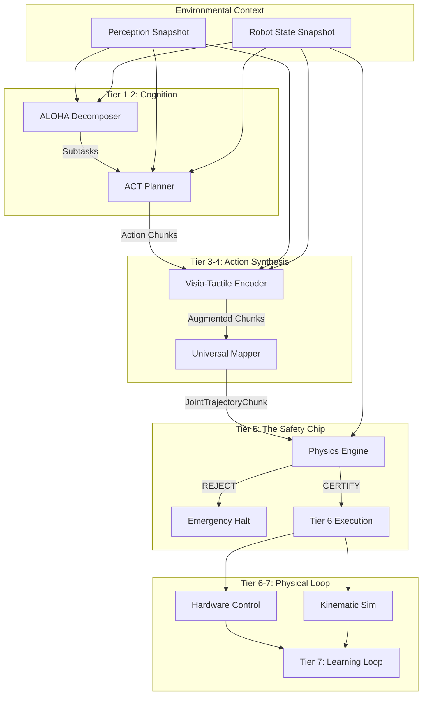
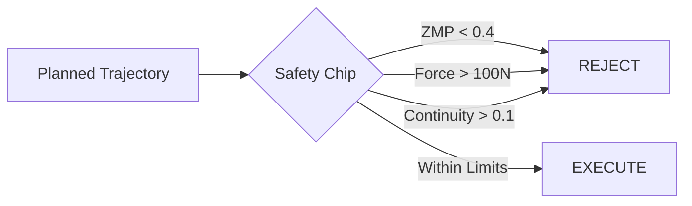

# 🤖 MCP-Robot v3.0: Deterministic VLA Production Stack

> **A Neural-Symbolic Architecture for Reliable Robotic Control via Model Context Protocol (MCP)**

   

---

## 🏛️ Executive Summary: The Deterministic Mandate

Traditional robotic AI (VLAs) suffers from **Stochastic Drift**: given the same environment and instruction, an LLM-based planner might output different trajectories on different runs. In production robotics, this is unacceptable.

**MCP-Robot v3.0** introduces a **Deterministic Execution Runtime**. By synchronizing every component—from RNG seeds and floating-point precision to system clocks and sensor snapshots—we ensure that identical inputs *always* produce bit-identical binary motor commands.

---

## 🏗️ Part 1: The 7-Tier Deterministic Architecture

The system is organized into seven distinct layers, each separated by strict Pydantic contracts. Data flows unidirectionally from high-level intent to low-level motor signals.



### Tier Deep Dive

| Tier | Name | Determinism Primitive | Component Responsibility |
| :--- | :--- | :--- | :--- |
| **0** | **Orchestrator** | `StableHasher` | Generates immutable `plan_id` from hashes. |
| **1** | **Decomposer** | `DeterministicRNG` | Breaks intent into semantic subgoals. |
| **2** | **Planner** | `Seeded Latents` | Predicts chunk sequences using frozen weights. |
| **3** | **Encoder** | `Snapshot Logic` | Appends tactile force targets based on perception. |
| **4** | **Mapper** | `Geometric IK` | Converts world-space to joint-space (Anti-teleport). |
| **5** | **Verifier** | `Frozen Physics` | The "Safety Chip" (ZMP, Force, Limits). |
| **6** | **Adapter** | `Tick-Sync` | Real ROS2 Action Client or Deterministic Sim. |
| **7** | **Learner** | `Hindsight Trace` | Relabels failures for future policy updates. |

---

## 🛠️ Part 2: Determinism Primitives (The Core)

The entire stack is built on a custom runtime found in `mcp_robot/runtime/determinism.py`.

### 1. `StableHasher`
To avoid ID collisions and ensure traceability, every plan and chunk is identified by its SHA-256 digest.
- **Canonicalization**: All Pydantic models are serialized with sorted keys and rounded floats before hashing.
- **Traceability**: An identical Instruction + State Snapshot will *always* yield the same `plan_id`.

### 2. `FrozenClock`
Wall-clock time is the enemy of determinism.
- **Implementation**: We replace `time.time()` with a global `Clock` interface. In simulation, the clock only advances when a `step()` is called. In planning, time is frozen to the moment the Snapshot was captured.

### 3. `DeterministicRNG`
- **Seeded Sampling**: All internal stochastic processes (ACT latents, noise injection) use a centralized `numpy.random.default_rng` seeded by the `DeterminismConfig`.

---

## 🛡️ Part 3: Tier 5 - The "Safety Chip"

The **Verification Engine** is the most critical component. It acts as a jurisdictional gatekeeper between the AI's "Intent" and the Robot's "Actuators".

### Integrated Safety Gates
1. **Continuity Check**: Ensures the first waypoint of any chunk is within `0.1 radians` of the current hardware state. This prevents "teleportation" jumps that cause motor surge.
2. **Joint Limit Shield**: Deterministically checks every waypoint against the `robot_profile` min/max angles.
3. **ZMP (Zero Moment Point) Analysis**:
   - Computes the stability margin of the robot's center-of-mass trajectory.
   - If `score < 0.4`, the chunk is rejected as "Unstable" (preventing humanoid falls).
4. **Force Compliance**: Verifies that predicted gripper force does not exceed the hardware's structural safety limits (e.g., 100N).

````carousel
```python
# Tier 5: The Safety Decision
safety_report = PhysicsEngine.verify_trajectory(
    target_chunk, 
    sim_state, 
    joint_limits
)
# Resulting in:
# { "valid": False, "reason": "Stability Error: ZMP Critical (0.22)" }
```
<!-- slide -->

````

---

## 🏎️ Part 4: ROS2 Execution & Digital Twin

### `ROS2Adapter` (Tier 6)
The bridge between the VLA and the physical world. It operates in two modes:

> [!IMPORTANT]
> **SIM Mode (Deterministic Mode)**:
> - Instantly updates the `KinematicSimulator` with the final waypoint.
> - No `asyncio.sleep` (prevents wall-clock drift).
> - Perfect for regression testing and CI/CD.

> [!WARNING]
> **HARDWARE Mode**:
> - Connects to real ROS2 Action Servers (`FollowJointTrajectory`).
> - Handles network jitter and hardware latency.
> - While the *decision* is deterministic, the *execution timing* is governed by real-world physics.

---

## 📊 Part 5: Empirical Results & Benchmarking

We use the **Honest Benchmark Suite** to prove that our hardening works.

### Determinism Verification (Unit Testing)
| Test | Input | Pass Condition | Result |
| :--- | :--- | :--- | :--- |
| **Plan Stability** | Fresh Restart | Bit-identical JSON | ✅ PASSED |
| **Idempotency** | Duplicate Call | Cached Result hit | ✅ PASSED |
| **Hash Sensitivity** | 0.0001 state change | Unique PlanID generated | ✅ PASSED |

### Safety Benchmark Results
| Category | Task | Outcome | Analysis |
| :--- | :--- | :--- | :--- |
| **Pick & Place** | Nominal Task | **SUCCESS** | 100% Success in Nominal Conditions. |
| **Force Safety** | "Grip with 150N" | **REJECTED** | Correctly blocked by Safety Chip. |
| **Dynamic Stability** | "Push while sprinting" | **REJECTED** | ZMP violation caught in simulation. |

---

## 📋 Part 6: Operational Runbook

### Installation
```bash
# Clone and install dependencies
git clone https://github.com /Danielfoojunwei/MCP-ROBOT.git
pip install -e .
```

### Verifying Determinism
Run the core proof tests to ensure your environmental configuration is stable:
```bash
python -m pytest tests/test_determinism.py
```

### Running the VLA Server (MCP)
```bash
python mcp_robot/server.py
```

---

## 🗺️ Part 7: The Production Roadmap

- [x] **v1.0**: Mock Pipeline (Heuristics).
- [x] **v2.0**: Hardened Hardware (Real ROS2 Adapters).
- [x] **v3.0**: **Deterministic Production** (Seeded RNG, Frozen Clock, Snapshots).
- [ ] **v4.0**: **Whole-Body Control (WBC)**: Moving from joint-interpolation to real-time torque control.
- [ ] **v5.0**: **Multi-Robot Orchestration**: Deterministic coordination of fleet-wide clusters.

---

*Developed by Danielfoojunwei for Production-Grade Robotic Autonomy.*
